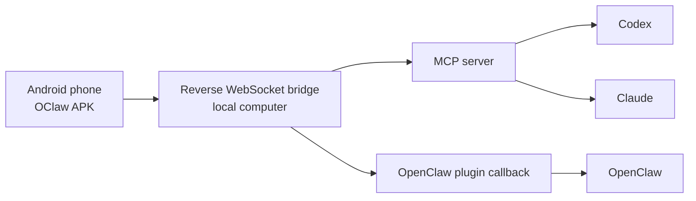

# Agent Mobile Toolkit

[中文说明](./README.zh-CN.md)

Turn an Android phone into a reusable mobile tool endpoint for Codex, OpenClaw, Claude, and other MCP-compatible agents.

## ✨ What this project is

Agent Mobile Toolkit packages the full mobile automation path into one repo:

1. 📱 OClaw Android app running on the phone
2. 🔌 Reverse WebSocket bridge running on your computer
3. 🧠 MCP server for Codex and Claude
4. 🛠️ OpenClaw plugin, skill assets, and workflow assets

This means you can connect one phone and reuse it across multiple agent runtimes instead of building a new mobile integration for each one.

## 🏗️ Architecture



## 🔗 Connection at a glance

```text
Phone
  -> ws://<LAN-IP>:8787/v1/providers/personal/join
  -> token: 123456

Computer
  -> bridge: http://127.0.0.1:8787/bridge
  -> MCP / plugin callback
```

## 🎯 Typical scenarios

Use Agent Mobile Toolkit when your agent needs to:

1. 🔍 Read the current Android UI tree
2. 🚀 Open apps and navigate mobile flows
3. 👆 Find and click UI elements by selector
4. ⌨️ Input text into search bars, forms, or chat boxes
5. 📸 Capture screenshots for reasoning and verification
6. 📍 Fall back to coordinate tap or swipe when accessibility data is incomplete
7. 📤 Upload screenshots or assets to the device before a mobile task starts
8. 🔁 Reuse the same mobile workflow across Codex, OpenClaw, and Claude

Typical real-world examples:

1. 📈 Mobile growth operations and lead capture
2. 🧾 Xiaohongshu search and mobile content workflows
3. 🤖 Android task automation from Codex or Claude
4. 🧰 Tool, skill, and workflow distribution for OpenClaw-style workspaces

## 🧭 How it works

```text
OClaw Android APK
  -> Reverse WebSocket bridge
  -> MCP / OpenClaw integration
  -> Codex / OpenClaw / Claude
```

The phone does not talk to the agent directly.  
It connects to a bridge, and the bridge exposes stable agent-facing tools.

## 🧩 Supported runtimes

1. Codex via MCP
2. Claude via MCP
3. OpenClaw via local plugin callback mode

## 🛠️ Exposed mobile tools

1. `mobile_list_devices`
2. `mobile_read_state`
3. `mobile_open_app`
4. `mobile_tap_screen`
5. `mobile_swipe_screen`
6. `mobile_find_element`
7. `mobile_click_element`
8. `mobile_input_text`
9. `mobile_upload_file`
10. `mobile_capture_screen`

These are the stable low-level tools you can build workflows on top of.

## 🧪 Practical operating pattern

1. Call `mobile_list_devices`
2. Call `mobile_read_state`
3. Prefer selector-based automation first
4. If the UI tree is incomplete, capture a screenshot and switch to coordinate tap or swipe
5. If the task needs images or files on the phone, upload them first and then continue the app flow

## 📦 APK download

Direct APK download:

1. [Download debug APK](https://github.com/ousir0/Agent-mobile-toolkit/releases/download/v0.1.0/com.droidrun.portal-0.1.0-debug.apk)

Release page:

1. [GitHub Releases](https://github.com/ousir0/Agent-mobile-toolkit/releases)

Local build output:

```text
app/build/outputs/apk/debug/com.droidrun.portal-0.6.4-debug.apk
```

## 🚀 Quick start

Install dependencies:

```bash
npm install
```

Start the bridge:

```bash
npm run bridge -- --host 0.0.0.0 --http-port 8787 --token 123456 --plugin-secret change-me
```

Phone custom connection:

```text
WebSocket URL: ws://<your-lan-ip>:8787/v1/providers/personal/join
Token: 123456
```

Notes:

1. Use a full WebSocket URL
2. Include `/v1/providers/personal/join`
3. Enter the token separately
4. Keep the phone and computer on the same LAN

## 💬 Quick install from a chat

If you want an agent to help install and wire things up, start with one of these prompts.

Codex:

```text
Install Agent Mobile Toolkit from https://github.com/ousir0/Agent-mobile-toolkit, set up the MCP server for this workspace, and give me the WebSocket URL and token for my Android phone.
```

OpenClaw:

```text
Install Agent Mobile Toolkit from https://github.com/ousir0/Agent-mobile-toolkit, install the OpenClaw mobile plugin, and configure the local bridge for this project.
```

Claude:

```text
Set up Agent Mobile Toolkit from https://github.com/ousir0/Agent-mobile-toolkit and generate the MCP config I should add for local mobile automation.
```

## 🤖 Codex setup

Generate Codex MCP config:

```bash
node scripts/bootstrap.mjs codex-config --bridge-url http://127.0.0.1:8787/bridge --bridge-secret change-me
```

Or register the MCP server directly:

```bash
codex mcp add agent-mobile-toolkit -- /opt/homebrew/bin/node /path/to/src/mcp-server.js --bridge-url http://127.0.0.1:8787/bridge --bridge-secret change-me
```

## 🧠 Claude setup

Generate Claude MCP config:

```bash
node scripts/bootstrap.mjs claude-config --bridge-url http://127.0.0.1:8787/bridge --bridge-secret change-me
```

## 🦀 OpenClaw setup

Generate OpenClaw plugin config:

```bash
node scripts/bootstrap.mjs openclaw-config --bridge-url http://127.0.0.1:8787/bridge --bridge-secret change-me
```

Install the OpenClaw plugin into a target project:

```bash
node scripts/bootstrap.mjs install-openclaw-plugin --target /path/to/oclaw
```

Export shared skills and workflows:

```bash
node scripts/bootstrap.mjs install-agent-assets --target /path/to/output
```

## 📁 Project structure

1. `app/` OClaw Android source code
2. `src/bridge-server.js` reverse bridge server
3. `src/mcp-server.js` MCP server for Codex and Claude
4. `integrations/openclaw/mobile-tools/` OpenClaw plugin
5. `scripts/bootstrap.mjs` config and asset bootstrapper
6. `skills/mobile-toolkit/` reusable mobile skill template
7. `workflows/` reusable workflow templates

## ✅ Development and verification

Node tests:

```bash
npm test
```

Android tests:

```bash
./gradlew test
```

Android debug build:

```bash
./gradlew assembleDebug
```

## 📄 License

Released under the MIT License.
